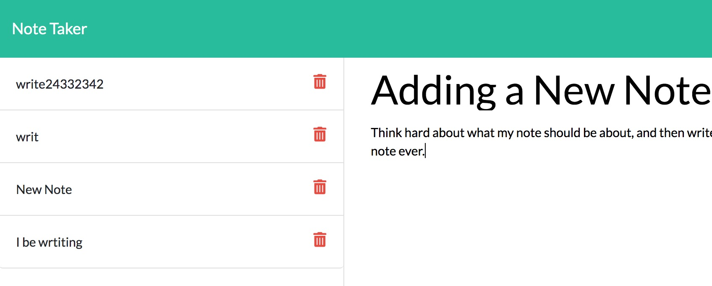

# Note Taker

## Description 

You are askig yourself right now, "How can I take some notes?!?" Relax, I've got just the thing. your first note could even be, "Start Utilizing Clayton's Note Taking App."

This project 

Please vist my live [Note Taker URL](https://salty-hamlet-26969.herokuapp.com//).

If you would like to see my GitHub repository, go on and [check it out here](https://github.com/Clayto30/note-taker).

## Table of Contents (Optional)

* [Installation](#installation)
* [Usage](#usage)
* [Credits](#credits)
* [License](#license)

## Installation

What are the steps required to install your project? Provide a step-by-step description of how to get the development environment running.

## Usage 

The best way to take some notes is to use [the live URL is deployed at Heroku](https://salty-hamlet-26969.herokuapp.com//)!

After you find yourself on the landing page, click on 'Get Started'!

Click on the pencil icon to start writing a note. Click on the save icon to save it.

Click on a note on the left to edit it! 

As a bonus, I am working on creating a delete route to delete notes! We'll see if I get this done under the deadline! 

## Credits

[Xander Rapstine](https://github.com/Xandromus) contributed the Starter Code, which created the front end for this project.

This project was created as a project as part of the UC Berkeley Coding Bootcamp instruction. My instructor and especially those ever-helpful TA's deserve special recognition.

## License

Copyright 2021 Clayton Goff

Permission is hereby granted, free of charge, to any person obtaining a copy of this software and associated documentation files (the "Software"), to deal in the Software without restriction, including without limitation the rights to use, copy, modify, merge, publish, distribute, sublicense, and/or sell copies of the Software, and to permit persons to whom the Software is furnished to do so, subject to the following conditions:

The above copyright notice and this permission notice shall be included in all copies or substantial portions of the Software.

THE SOFTWARE IS PROVIDED "AS IS", WITHOUT WARRANTY OF ANY KIND, EXPRESS OR IMPLIED, INCLUDING BUT NOT LIMITED TO THE WARRANTIES OF MERCHANTABILITY, FITNESS FOR A PARTICULAR PURPOSE AND NONINFRINGEMENT. IN NO EVENT SHALL THE AUTHORS OR COPYRIGHT HOLDERS BE LIABLE FOR ANY CLAIM, DAMAGES OR OTHER LIABILITY, WHETHER IN AN ACTION OF CONTRACT, TORT OR OTHERWISE, ARISING FROM, OUT OF OR IN CONNECTION WITH THE SOFTWARE OR THE USE OR OTHER DEALINGS IN THE SOFTWARE.